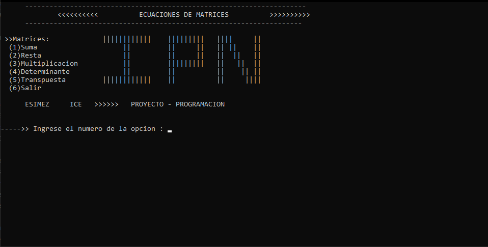
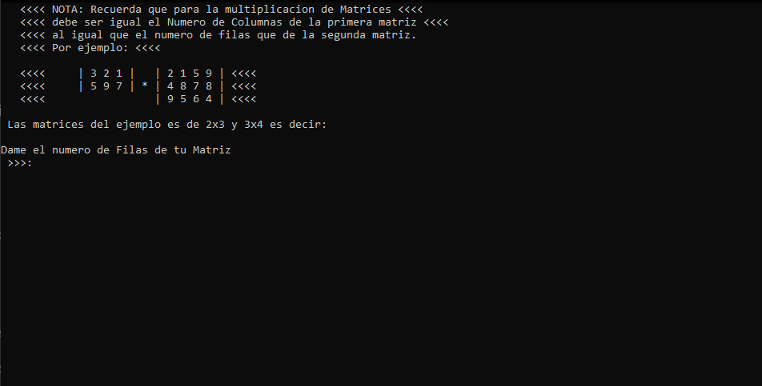
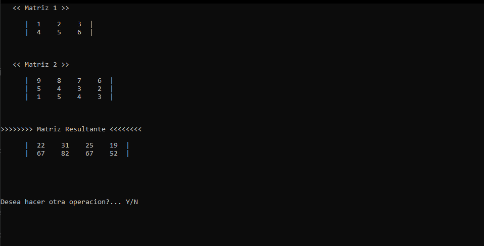
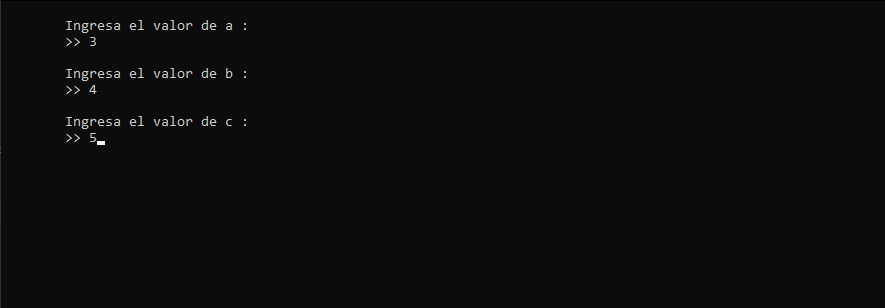
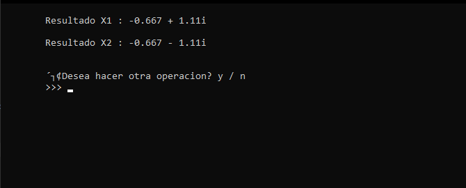

# Matrices-cpp
Es un codigo hecho en C++ que resuelve problemas de matrices. 
Engloba solamente fundamentos de programacion como tambien punteros y memoria dinamica
Los problemas de matrices que resuelve son:
* Suma de matrices
* Resta de matrices
* Multiplicacion de matrices
* Determinante de una matriz
* Transpuesta de una matriz
## Algunos ejemplos:
Menu Principal

Ingreso de datos

Resultados por pantalla

# Formula General cpp
Es un codigo hecho en C++ que resuelve problemas de ecuaciones de segundo grado
Engloba solamente fundamentos de programacion lo cual calcula parte Real y Parte Imaginaria de la ecuacion
Su estructura es ax^2 + bx + c = 0
## Algunos ejemplos:
Ingreso los valores de los coefiecientes de la ecuacion de segundo grado

Resultado de la ecuacion

